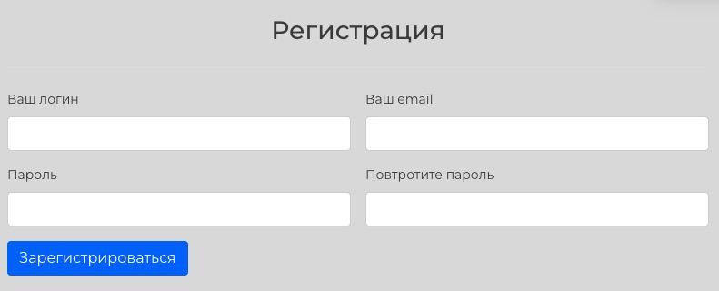
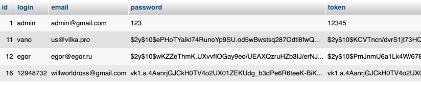
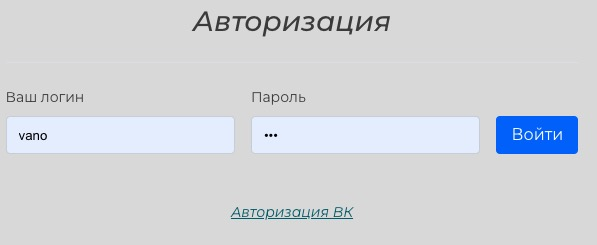
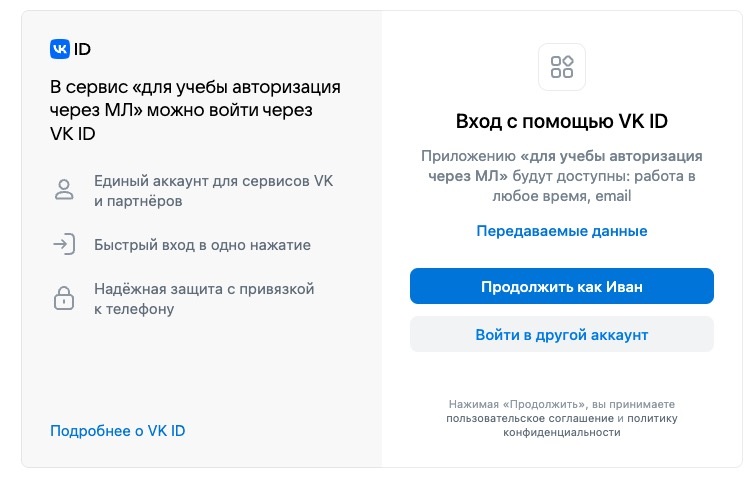
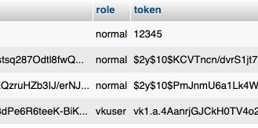
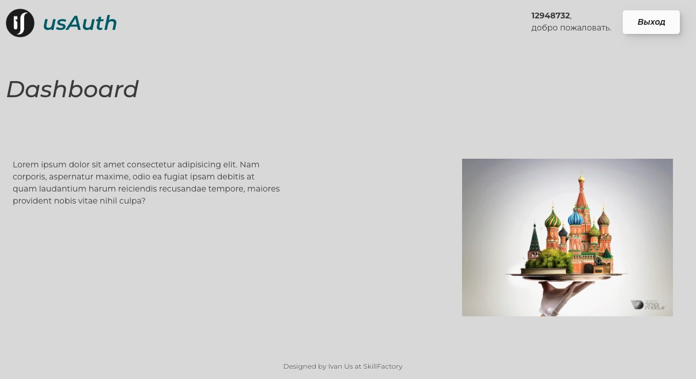
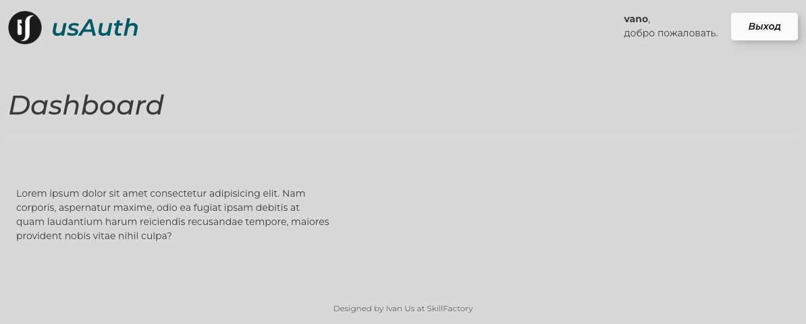
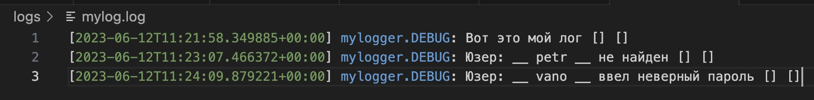

# Моя чудесная авториация

## 1. Система регистрации

Сделано

--- 
 

## 2. Сделать страницу авторизации

Сделано

---
 

## 3. Сделать авторизацию через VK

Сделано

---
 

## 4. Сделать систему с ролями

Сделано

---
 

## 5. Сделать страницу, на которую нельзя попасть, пока пользователь не авторизован. Текст должен быть виден всем авторизованным пользователям, картинка — только пользователям с ролью «пользователь VK» 

Сделано

---
 

## 6. Сделать систему хранения логов 

Сделано. Храним здесь: logs/mylog.log

---
 